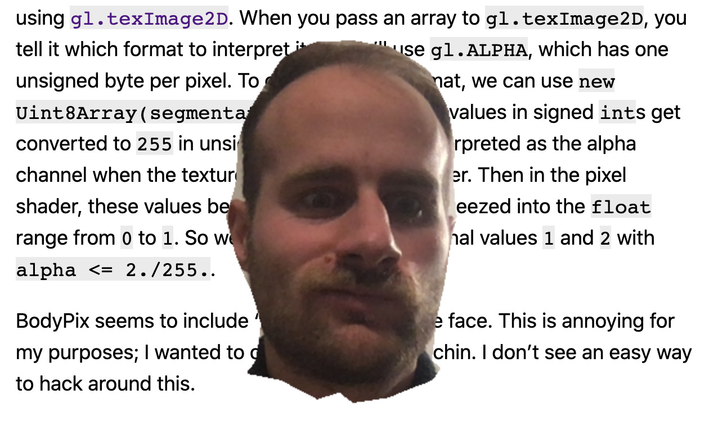

In [a previous post](/2020/09/24/using-bodypix-segmentation-in-a-webgl-shader/).
I showed how to run BodyPix on a video stream
and access the segmentation from your shader.
In this post,
I demo the `segmentPersonParts` method,
using it to make a floating head.
You can run it on your own webcam;
<button onclick="main(); this.onclick=null">click here to start the demo!</button>

A call to `net.segmentPerson` returns a `Uint8Array`
where each value is either `1` (part of a person)
or `0` (not part of a person).
But the API also provides `net.segmentPersonParts`,
which returns an `Int32Array`,
but where the values are between `-1` and `23`,
with `-1` being not part of a person,
and the other numbers being various parts.
Here I'm just interested in values `0` and `1`,
which represent parts "left side of face" and "right side of face".

To access this data in a WebGL shader,
we need to get it into a texture using [`gl.texImage2D`](https://developer.mozilla.org/en-US/docs/Web/API/WebGLRenderingContext/texImage2D).
When you pass an array to `gl.texImage2D`,
you tell it which format to interpret it as.
We'll use `gl.ALPHA`, which has one unsigned byte per pixel.
To convert to this format, we can use `new Uint8Array(segmentation.data)`.
The `-1` values in signed `int`s get converted to `255` in unsigned ints.
This byte interpreted as the alpha channel when the texture is accessed by a shader.
Then in the pixel shader, these values between `0` and `255`
are squeezed into the `float` range from `0` to `1`.
So we can check for the original values `1` and `2` with
`alpha <= 2./255.`.

BodyPix seems to include "neck" as part of the face.
This is annoying for my purposes;
I wanted to crop the face at the chin.
I don't see an easy way to hack around this.

Finally, here's what I get when I run the demo against my own webcam feed:

<canvas id="display" style="position: fixed; bottom: 0; right: 0;"></canvas>

<video id="webcam" style="display: none;"></video>

